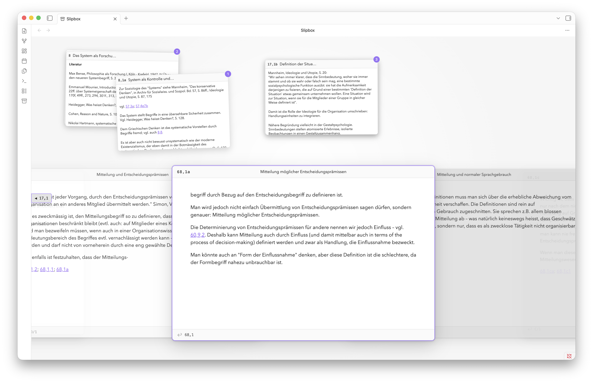

# Slipbox

The Slipbox is an experiment in bringing a paper-based _Zettelkasten_ experience to Obsidian.



> Slipbox is under active development. It requires Obsidian 1.13.0 or newer on desktop and is not yet available through Community plugins.

The Slipbox plugin provides a unified _Deck_ and _Desk_ view, where the main _Zettelkasten_ sequence of notes can be browsed, and cards can be taken out and placed in piles on the Desk. The placement of cards on the Desk and a map of the whole _Zettelkasten_ hope to provide spatial intuition for where to find things.

A note becomes a card when it has the configured address property. The default is `slipbox-id`:

```yaml
---
slipbox-id: "68/1a"
---
```

The address on each note determines its place in the linear sequence of cards that constitute the Deck.

## Philosophy

My proposal is that the customary niceties of digital note-taking like search, folders, tags, following links, infinite scroll, etc. can ultimately detract from the serendipitous resurfacing of old, forgotten ideas, which is the whole point of _Zettelkasten_.

The most strict paper-like experience might be too extreme for some users. For this reason, some of the more shocking modifications can be toggled in the settings: disabling the deleting of text, augmenting the ability to paste text, follow links, etc. Of course, these modifications only alter editing in the Slipbox view, and regular markdown editing elsewhere in Obsidian is never restricted.

## Deck and Desk

| Surface | Purpose | Persistence |
| --- | --- | --- |
| **Deck** | Browse filed cards in address order | Derived from Markdown frontmatter |
| **Desk** | Work with unfiled cards and temporary piles | Current Obsidian session |

The Deck is the canonical sequence, while the Desk is a temporary working area beside it. Cards on the Desk keep their filed address and remain in the Deck. Slipbox interfaces with Obsidian's Canvas, and piles can be moved to an existing or new Canvas easily.

## Features

- Browse rendered Markdown cards with the keyboard, track your place on the Deck map, and keep bookmarks.
- Pull filed cards onto the Desk without changing their address or filing order.
- Expand, collapse, reorder, split, merge, and move Desk piles.
- View and edit Desk cards inside the Slipbox workspace.
- File an unfiled card while checking where it will enter the real Deck.
- Follow card links, copy links, insert links from an Obsidian editor, and show automatic backlinks.
- Configure card sizes, titles, header actions, ordering, shortcuts, and the paper workflow.

## Installation

Until Slipbox is published through Community plugins, install it from a GitHub Release:

1. Download `manifest.json`, `main.js`, and `styles.css` from the same release.
2. Put the files in `<Vault>/.obsidian/plugins/slipbox/`.
3. Reload Obsidian.
4. Enable Slipbox under **Settings → Community plugins**.

Use the archive ribbon icon or run **Slipbox: Open** from the command palette.

A source checkout does not include the generated `main.js`. Run `npm run build` before loading a checkout directly in Obsidian.

## Quick start

1. Enter the Slipbox with **Slipbox: Open**
2. Right click anywhere to create a new note.
3. Double click the note body to write your note.
4. Double click the empty address field to file the card.
5. Navigate the Slipbox Deck by scrolling.
6. Drag Deck cards onto the Desk to make new piles.

Cards can also be added to the Deck by adding a `slipbox-id` property to the Markdown note. This can also be done using **Slipbox: Make active Markdown note a card**.

Any trimmed, nonempty, single-line string without control characters is a valid address. Slipbox accepts addresses such as `1/2b1`, `A/1`, `Project-17`, and `α/12`.

Natural address ordering is the default, so `A/2` comes before `A/10`. Lexicographic ordering is also available. Duplicate addresses are allowed by default, but they can be optionally reported. Slipbox never rewrites an existing address automatically.

## Essential keys

There are some actions that are very quick to do in the real world, but take time in the digital world. For this reason, a default set of vim-inspired keybindings tries to streamline the process of all such card actions.

| Key | Action |
| --- | --- |
| `←` / `k` | Move to the previous Deck card |
| `→` / `j` | Move to the next Deck card |
| `p` | Put the focused card on the Desk, or return it |
| `e` | Edit the focused Desk or viewed card |
| `v` | View a Desk card, or return a viewed card |
| `{` / `}` | Cycle focus through the Deck and Desk piles |
| `%` | Swap focus between the Deck and the last pile |
| `Space` | Expand or collapse the focused pile |
| `b` | Toggle the focused Deck card's bookmark |
| `y` | Copy a link to the focused card |
| `o` | Open the focused card as a Markdown note |

Slipbox shortcuts apply only while a Slipbox view is active. You can change them under **Settings → Slipbox**. Obsidian hotkeys take priority when bindings conflict.

## Data and privacy

Slipbox works locally and offline. It makes no network requests, collects no telemetry, and does not load remote code.

Cards remain ordinary Markdown files. Slipbox reads and writes vault files only for actions you start, such as editing, filing, linking, and Canvas layout. The Desk is session-only and is not written to Markdown or plugin data.

## Development

Development requires Node.js 20 or newer and npm.

```sh
npm ci
npm run check
```

`npm run check` runs TypeScript checking, tests, ESLint, a production build, and release validation. `npm run build` produces the ignored `main.js` used by Obsidian.

See the [release candidate smoke test](docs/release-candidate-smoke-test.md) for the manual verification checklist.

This is my first Obsidian plugin. Please help me.

## Support and license

Report bugs and request features through GitHub Issues.

Slipbox is available under the [0BSD license](LICENSE).
